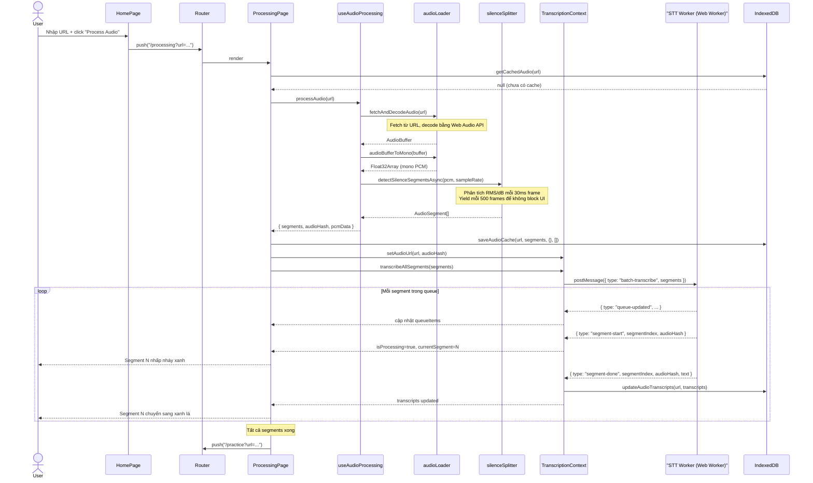
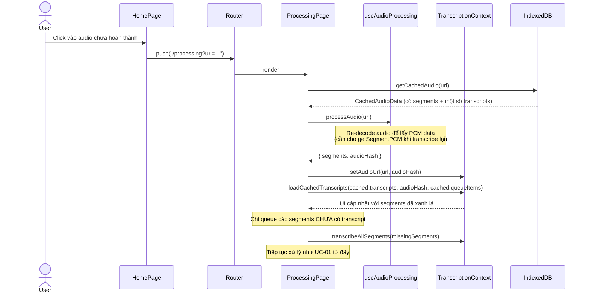
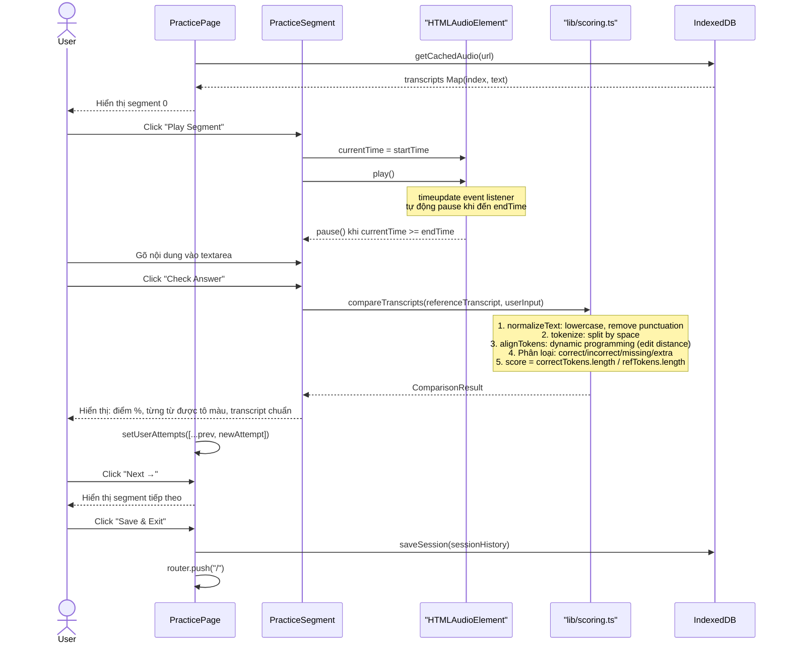
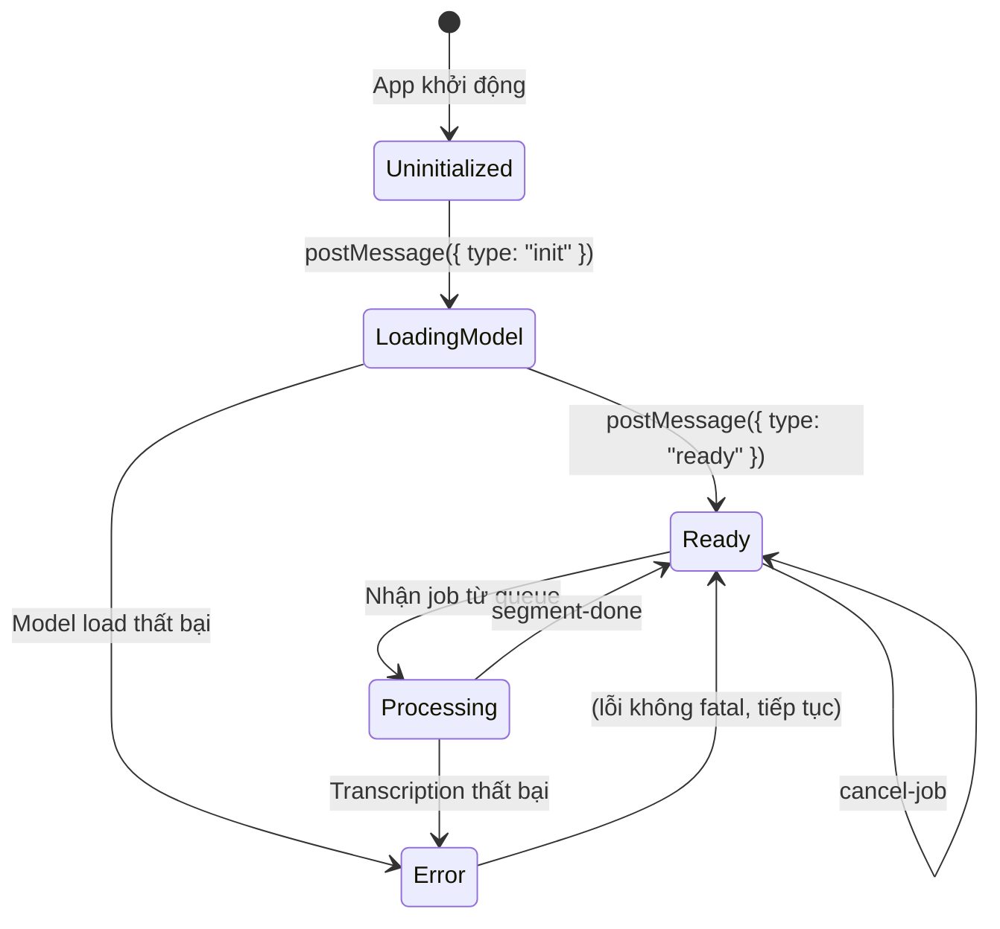
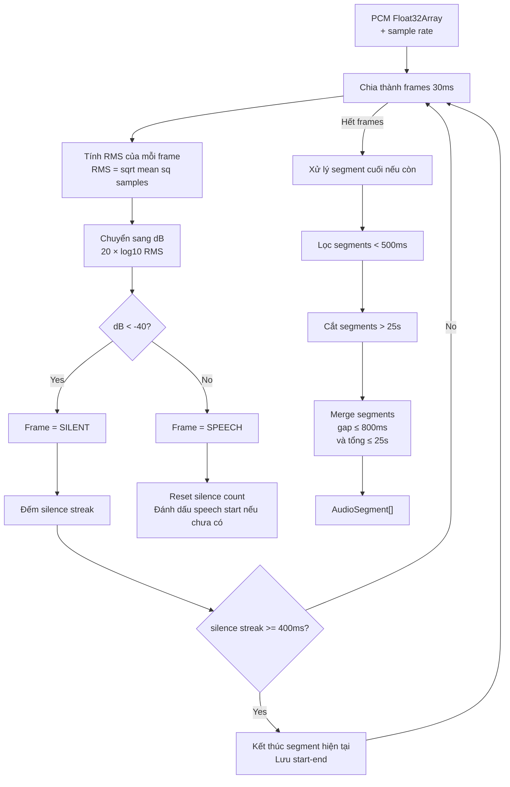

# Software Requirements Specification (SRS)

## Listening Practice Tool

**Phiên bản:** 1.0
**Ngày:** 2026-03-25
**Trạng thái:** Draft

---

## Mục Lục

1. [Giới Thiệu](#1-giới-thiệu)
2. [Mô Tả Tổng Quan](#2-mô-tả-tổng-quan)
3. [Yêu Cầu Chức Năng](#3-yêu-cầu-chức-năng)
4. [Yêu Cầu Phi Chức Năng](#4-yêu-cầu-phi-chức-năng)
5. [Use Cases Chi Tiết](#5-use-cases-chi-tiết)
6. [Data Model](#6-data-model)
7. [Kiến Trúc Hệ Thống](#7-kiến-trúc-hệ-thống)
8. [Dataflow & Sequence Diagrams](#8-dataflow--sequence-diagrams)
9. [Màn Hình & Giao Diện](#9-màn-hình--giao-diện)
10. [Thuật Toán](#10-thuật-toán)
11. [Chiến Lược Lưu Trữ](#11-chiến-lược-lưu-trữ)
12. [Yêu Cầu Tương Lai](#12-yêu-cầu-tương-lai)

---

## 1. Giới Thiệu

### 1.1 Mục Đích

Tài liệu này là Đặc Tả Yêu Cầu Phần Mềm (SRS) cho **Listening Practice Tool** — một ứng dụng web luyện nghe và chính tả ngôn ngữ. Tài liệu mô tả đầy đủ các yêu cầu chức năng, phi chức năng, luồng dữ liệu, và thiết kế hệ thống của sản phẩm, phục vụ mục đích phát triển, kiểm thử và bảo trì.

### 1.2 Phạm Vi

**Listening Practice Tool** là một ứng dụng web chạy hoàn toàn phía client (không có backend server). Ứng dụng cho phép người dùng:

- Cung cấp URL đến bất kỳ file audio nào trên internet (MP3, WAV, OGG, v.v.)
- Hệ thống tự động tải audio, phân tách thành các đoạn ngắn dựa trên vùng im lặng
- Chuyển đổi từng đoạn audio thành văn bản bằng AI (Whisper) chạy trực tiếp trong trình duyệt
- Người dùng luyện chính tả: nghe từng đoạn và gõ lại nội dung họ nghe được
- Nhận phản hồi tức thời về độ chính xác ở cấp độ từng từ

Ứng dụng nhắm đến người học ngoại ngữ muốn cải thiện kỹ năng nghe hiểu thông qua luyện tập chính tả có hệ thống.

### 1.3 Định Nghĩa & Thuật Ngữ

| Thuật ngữ | Định nghĩa |
|---|---|
| **Segment** | Một đoạn âm thanh được cắt ra từ file audio gốc, tương ứng với một câu hoặc một cụm từ liên tục |
| **Transcription** | Văn bản chuyển đổi từ audio bằng AI (speech-to-text) |
| **Dictation / Chính tả** | Bài tập nghe và gõ lại những gì nghe được |
| **PCM** | Pulse-Code Modulation — định dạng âm thanh thô ở dạng mảng số thực |
| **Whisper** | Mô hình AI nhận dạng giọng nói của OpenAI, được dùng qua thư viện @xenova/transformers chạy bằng WebAssembly |
| **WASM** | WebAssembly — công nghệ cho phép chạy code nhị phân hiệu năng cao trong trình duyệt |
| **Web Worker** | Luồng xử lý nền trong trình duyệt, không ảnh hưởng đến UI thread |
| **IndexedDB** | Cơ sở dữ liệu nhúng trong trình duyệt, dùng để lưu trữ persistent |
| **Audio Hash** | Mã định danh duy nhất cho mỗi URL audio, sinh bằng hàm hash 32-bit |
| **WER** | Word Error Rate — tỉ lệ lỗi từ, chỉ số đánh giá chất lượng chính tả |
| **Silence Detection** | Thuật toán phát hiện vùng im lặng trong audio để cắt thành các segment |
| **Queue** | Hàng đợi các segment chờ được phiên âm |

### 1.4 Tổng Quan Tài Liệu

- **Mục 2**: Mô tả tổng quan sản phẩm, người dùng mục tiêu, và các ràng buộc chính
- **Mục 3**: Yêu cầu chức năng chi tiết
- **Mục 4**: Yêu cầu phi chức năng (hiệu năng, bảo mật, khả năng tương thích)
- **Mục 5**: Các use case với actor, precondition, flow, và postcondition
- **Mục 6**: Data model và schema cơ sở dữ liệu
- **Mục 7**: Kiến trúc hệ thống
- **Mục 8**: Sequence diagram minh họa các luồng chính
- **Mục 9**: Mô tả chi tiết các màn hình và component
- **Mục 10**: Thuật toán xử lý âm thanh và chấm điểm
- **Mục 11**: Chiến lược lưu trữ và caching
- **Mục 12**: Yêu cầu tương lai

---

## 2. Mô Tả Tổng Quan

### 2.1 Bối Cảnh Sản Phẩm

Listening Practice Tool là một ứng dụng web độc lập (standalone). Không có backend server, không có tài khoản người dùng, không có database trung tâm. Toàn bộ hệ thống chạy trong một tab trình duyệt duy nhất.

```
[Người dùng] <──> [Trình duyệt Web]
                        │
                        ├── [Next.js App] ─── render UI
                        ├── [Web Worker] ─── chạy Whisper AI (WASM)
                        ├── [IndexedDB]  ─── lưu trữ local
                        └── [Web Audio API] ── xử lý audio

[Internet] ──fetch──> [Audio URL] (chỉ tải file audio, không gửi dữ liệu)
[CDN/R2]   ──fetch──> [Whisper Model Files] (tải model một lần, cache browser)
```

Ứng dụng tương tác với hai nguồn bên ngoài:
1. **URL audio của người dùng**: File audio được fetch trực tiếp từ URL do người dùng cung cấp
2. **Model AI**: Các file ONNX của Whisper được bundle vào build artifact hoặc phục vụ từ CDN (Cloudflare R2), tải về lần đầu tiên và được cache bởi browser

### 2.2 Chức Năng Cốt Lõi

```
┌─────────────────────────────────────────────────────┐
│               Listening Practice Tool               │
│                                                     │
│  1. INPUT        URL audio ──► Tải & giải mã        │
│  2. ANALYZE      Audio gốc ──► Phân đoạn silence    │
│  3. TRANSCRIBE   Segments  ──► Whisper AI (WASM)    │
│  4. PRACTICE     Transcript ──► Bài tập chính tả    │
│  5. SCORE        Đáp án    ──► Phản hồi từng từ     │
│  6. CACHE        Kết quả   ──► IndexedDB            │
└─────────────────────────────────────────────────────┘
```

### 2.3 Người Dùng Mục Tiêu

| Nhóm | Đặc điểm | Nhu cầu |
|---|---|---|
| **Người học ngoại ngữ** | Đang học tiếng Anh hoặc ngôn ngữ khác, trình độ A2-C1 | Cải thiện kỹ năng nghe, phân biệt âm tiết |
| **Học sinh/Sinh viên** | Chuẩn bị cho các kỳ thi nghe (IELTS, TOEFL, JLPT) | Luyện tập có hệ thống với feedback chi tiết |
| **Người tự học** | Muốn luyện nghe với nội dung tự chọn (podcast, bài giảng, v.v.) | Không bị giới hạn nội dung, không mất phí subscription |
| **Giáo viên** | Tạo bài tập nghe cho học sinh | Công cụ đơn giản, không cần server |

### 2.4 Ràng Buộc Hệ Thống

| Ràng buộc | Mô tả |
|---|---|
| **Không có backend** | Mọi xử lý đều xảy ra trong trình duyệt; không có API server, không có database trung tâm |
| **Không có dữ liệu người dùng** | Không thu thập, không lưu, không truyền dữ liệu cá nhân; GDPR compliant by design |
| **CORS** | Audio URL phải cho phép cross-origin fetch; Model files phải được phục vụ từ cùng origin hoặc có CORS header |
| **Browser requirement** | Yêu cầu Web Audio API, Web Workers, WebAssembly, IndexedDB, SharedArrayBuffer (nếu dùng threading), ES2020+ |
| **Model size** | Whisper base.en ~140MB — tải một lần, cache browser |
| **Segment giới hạn** | Mỗi segment tối đa 25 giây (giới hạn xử lý của Whisper với chunk 30s) |

### 2.5 Giả Định

- Người dùng có kết nối internet khi lần đầu sử dụng (để tải model và audio)
- URL audio không yêu cầu xác thực và có CORS header phù hợp
- Trình duyệt có đủ bộ nhớ RAM để lưu audio buffer (~10-50MB cho file 30 phút)
- Sau lần tải model đầu tiên, mọi thao tác có thể hoạt động offline

---

## 3. Yêu Cầu Chức Năng

### FR-01: Nhập URL Audio

**Mô tả:** Hệ thống phải cho phép người dùng nhập URL đến file audio.

| ID | Yêu cầu |
|---|---|
| FR-01.1 | Hệ thống phải cung cấp một ô nhập text để người dùng paste URL |
| FR-01.2 | Hệ thống phải kiểm tra URL có đúng định dạng (bắt đầu bằng `http://` hoặc `https://`) |
| FR-01.3 | Khi người dùng submit, hệ thống phải điều hướng ngay đến màn hình Processing |
| FR-01.4 | URL phải được truyền qua query parameter của đường dẫn `/processing?url=<encoded_url>` |
| FR-01.5 | Hệ thống phải hiển thị danh sách các audio đã được xử lý trước đó (từ cache) |

### FR-02: Kiểm Tra Cache

**Mô tả:** Trước khi xử lý audio mới, hệ thống phải kiểm tra xem audio đó đã được xử lý trước đây chưa.

| ID | Yêu cầu |
|---|---|
| FR-02.1 | Hệ thống phải sinh một hash duy nhất từ URL audio (dùng làm cache key) |
| FR-02.2 | Nếu audio đã có trong cache (có segments), hệ thống phải tải dữ liệu từ cache thay vì xử lý lại từ đầu |
| FR-02.3 | Nếu audio đã được phiên âm một phần, hệ thống phải tiếp tục từ điểm bị dừng |
| FR-02.4 | Nếu audio đã được phiên âm hoàn toàn, hệ thống phải cho phép vào thẳng màn hình Practice |

### FR-03: Tải và Giải Mã Audio

**Mô tả:** Hệ thống phải tải file audio từ URL và giải mã thành dữ liệu PCM có thể xử lý.

| ID | Yêu cầu |
|---|---|
| FR-03.1 | Hệ thống phải fetch file audio từ URL bằng Fetch API của browser |
| FR-03.2 | Hệ thống phải giải mã audio bằng Web Audio API (`AudioContext.decodeAudioData`) |
| FR-03.3 | Nếu audio có nhiều channel (stereo), hệ thống phải trộn xuống mono bằng cách lấy trung bình cộng |
| FR-03.4 | Hệ thống phải hiển thị thanh tiến trình trong suốt quá trình tải |
| FR-03.5 | Hệ thống phải hiển thị thông báo lỗi rõ ràng nếu fetch thất bại (URL không hợp lệ, CORS error, v.v.) |

### FR-04: Phân Đoạn Audio (Silence Detection)

**Mô tả:** Hệ thống phải tự động phân chia audio thành các segment dựa trên vùng im lặng.

| ID | Yêu cầu |
|---|---|
| FR-04.1 | Hệ thống phải chia audio thành các frame 30ms và tính năng lượng RMS của mỗi frame |
| FR-04.2 | Frame có năng lượng dưới -40dB được coi là im lặng |
| FR-04.3 | Vùng im lặng liên tục tối thiểu 400ms mới được coi là điểm cắt segment |
| FR-04.4 | Segment tối thiểu phải dài 500ms mới được giữ lại |
| FR-04.5 | Segment vượt quá 25 giây phải được tự động cắt đôi thành các chunk nhỏ hơn |
| FR-04.6 | Hai segment liền kề có khoảng cách nhỏ hơn 800ms phải được gộp lại (nếu tổng thời gian ≤ 25s) |
| FR-04.7 | Quá trình này phải không blocking UI (async với periodic yield mỗi 500 frames) |
| FR-04.8 | Mỗi segment phải mang thông tin: `start` (giây), `end` (giây), `audioHash`, `segmentId` |

### FR-05: Phiên Âm Speech-to-Text

**Mô tả:** Hệ thống phải chuyển đổi từng audio segment thành văn bản bằng model Whisper.

| ID | Yêu cầu |
|---|---|
| FR-05.1 | Hệ thống phải chạy Whisper trong một Web Worker riêng biệt để không block UI |
| FR-05.2 | Model Whisper phải được tải một lần và tái sử dụng cho tất cả các segment |
| FR-05.3 | Các segment phải được resample về 16kHz trước khi gửi vào model |
| FR-05.4 | Hệ thống phải xử lý các segment theo thứ tự (FIFO queue) |
| FR-05.5 | Sau khi hoàn thành mỗi segment, hệ thống phải cập nhật UI ngay lập tức |
| FR-05.6 | Transcript của mỗi segment phải được lưu vào cache ngay sau khi hoàn thành |
| FR-05.7 | Hệ thống phải cho phép cancel các segment đang chờ trong queue |
| FR-05.8 | Hệ thống phải cho phép clear toàn bộ queue |
| FR-05.9 | Khi tất cả segment được phiên âm, hệ thống phải tự động điều hướng sang Practice (sau 1 giây) |
| FR-05.10 | Hệ thống phải cho phép người dùng bắt đầu practice khi đã có ít nhất 10 segment được phiên âm (không cần đợi hết) |

### FR-06: Hiển Thị Tiến Trình Phiên Âm

**Mô tả:** Hệ thống phải trực quan hóa trạng thái xử lý của từng segment.

| ID | Yêu cầu |
|---|---|
| FR-06.1 | Mỗi segment phải được hiển thị như một thanh màu (proportional với thời lượng của segment) |
| FR-06.2 | Màu xanh lá = segment đã hoàn thành phiên âm |
| FR-06.3 | Màu xanh dương nhấp nháy (animate-pulse) = segment đang được phiên âm |
| FR-06.4 | Màu xám = segment đang chờ |
| FR-06.5 | Các segment phải được sắp xếp thành nhiều hàng theo thứ tự, với chiều rộng tỉ lệ với thời lượng |
| FR-06.6 | Hệ thống phải hiển thị tổng số segment và số segment đã hoàn thành |

### FR-07: Sidebar Hàng Đợi (Queue Sidebar)

**Mô tả:** Hệ thống phải có một panel bên phải hiển thị trạng thái real-time của queue phiên âm.

| ID | Yêu cầu |
|---|---|
| FR-07.1 | Sidebar phải chỉ hiển thị khi có segment đang xử lý hoặc đang trong queue |
| FR-07.2 | Sidebar phải hiển thị segment nào đang được xử lý (với spinner animation) |
| FR-07.3 | Sidebar phải liệt kê tất cả các segment đang chờ trong queue (theo thứ tự) |
| FR-07.4 | Mỗi item trong queue phải hiển thị: tên file audio (trích từ URL), số segment |
| FR-07.5 | Người dùng phải có thể cancel từng item trong queue |
| FR-07.6 | Người dùng phải có thể clear toàn bộ queue cùng một lúc (với confirm dialog) |
| FR-07.7 | Sidebar phải có thể thu gọn/mở rộng |
| FR-07.8 | Khi thu gọn, sidebar phải hiển thị badge số lượng items đang chờ |

### FR-08: Màn Hình Danh Sách Audio Đã Lưu

**Mô tả:** Màn hình chính phải hiển thị tất cả các audio đã được xử lý trước đây.

| ID | Yêu cầu |
|---|---|
| FR-08.1 | Hệ thống phải hiển thị danh sách audio được sắp xếp theo thời gian truy cập gần nhất |
| FR-08.2 | Mỗi item phải hiển thị: tên file, số segment, thời gian truy cập cuối, tỉ lệ phiên âm |
| FR-08.3 | Mỗi item phải có thanh tiến trình phiên âm (xanh nếu hoàn thành, xanh dương nếu chưa xong) |
| FR-08.4 | Click vào audio đã hoàn thành → điều hướng đến Practice |
| FR-08.5 | Click vào audio chưa hoàn thành → điều hướng đến Processing để tiếp tục |
| FR-08.6 | Mỗi item phải có nút xóa (với confirm dialog) |
| FR-08.7 | Xóa một audio phải xóa cả metadata và transcripts khỏi cache |
| FR-08.8 | Nếu chưa có audio nào, hiển thị thông báo hướng dẫn người dùng |

### FR-09: Màn Hình Luyện Tập (Practice)

**Mô tả:** Màn hình practice phải cho phép người dùng luyện chính tả từng segment.

| ID | Yêu cầu |
|---|---|
| FR-09.1 | Hệ thống phải hiển thị một segment tại một thời điểm |
| FR-09.2 | Người dùng phải có thể phát audio của segment bằng nút Play |
| FR-09.3 | Phát audio phải chỉ phát đúng đoạn của segment (từ `start` đến `end`), không phát toàn bộ file |
| FR-09.4 | Hệ thống phải hiển thị số thứ tự segment và timestamp (VD: "1:23 – 1:45") |
| FR-09.5 | Hệ thống phải cung cấp textarea để người dùng gõ transcription của họ |
| FR-09.6 | Nút "Check Answer" phải so sánh input với transcript chuẩn và hiển thị kết quả |
| FR-09.7 | Nút "Try Again" phải xóa input và cho phép người dùng thử lại |
| FR-09.8 | Nút "Previous" / "Next" phải điều hướng giữa các segment |
| FR-09.9 | Navigation buttons phải bị disable nếu segment kề bên chưa có transcript |
| FR-09.10 | Nếu segment hiện tại chưa có transcript, hiển thị trạng thái "đang phiên âm" |
| FR-09.11 | Thanh tiến trình phải hiển thị số segment đã làm / tổng số segment |
| FR-09.12 | Nếu transcription vẫn đang chạy trong nền, hiển thị banner cảnh báo với thanh tiến trình |
| FR-09.13 | Người dùng phải có thể lưu session và thoát về trang chủ |

### FR-10: Chấm Điểm Và Phản Hồi

**Mô tả:** Sau khi người dùng submit, hệ thống phải hiển thị phản hồi chi tiết về câu trả lời.

| ID | Yêu cầu |
|---|---|
| FR-10.1 | Hệ thống phải hiển thị điểm số phần trăm (0-100%) |
| FR-10.2 | Hệ thống phải phân loại từng từ thành: **Correct** (xanh lá), **Incorrect** (đỏ), **Missing** (cam), **Extra** (tím) |
| FR-10.3 | So sánh phải không phân biệt hoa thường |
| FR-10.4 | So sánh phải bỏ qua dấu câu |
| FR-10.5 | Hệ thống phải hiển thị transcript chuẩn sau khi chấm điểm |
| FR-10.6 | Điểm số = (số từ đúng / tổng số từ trong transcript chuẩn) × 100 |
| FR-10.7 | Hệ thống phải hiển thị thanh progress bar tương ứng với điểm |
| FR-10.8 | Mỗi attempt phải được lưu vào session history với: segmentIndex, userInput, score, timestamp |

### FR-11: Lưu Trữ Và Phục Hồi Session

**Mô tả:** Hệ thống phải lưu trữ dữ liệu bền vững để người dùng có thể tiếp tục sau khi đóng tab.

| ID | Yêu cầu |
|---|---|
| FR-11.1 | Toàn bộ thông tin audio (segments, transcripts) phải được lưu trong IndexedDB |
| FR-11.2 | Mỗi segment transcript phải được lưu ngay sau khi phiên âm xong |
| FR-11.3 | Khi người dùng quay lại một audio đã xử lý, hệ thống phải tải transcript từ cache thay vì xử lý lại |
| FR-11.4 | Lịch sử các attempts của người dùng phải được lưu trong `sessions` table |
| FR-11.5 | "Save & Exit" phải lưu session history và điều hướng về trang chủ |
| FR-11.6 | Hệ thống phải ghi nhận thời gian truy cập cuối (`lastAccessed`) cho mỗi audio |

---

## 4. Yêu Cầu Phi Chức Năng

### NFR-01: Hiệu Năng

| ID | Yêu cầu |
|---|---|
| NFR-01.1 | UI phải luôn responsive trong khi Whisper đang xử lý (không block main thread) |
| NFR-01.2 | Silence detection phải không gây jank cho file audio dài (yield mỗi 500 frames) |
| NFR-01.3 | Mỗi segment transcript phải xuất hiện trên UI trong vòng 1 giây sau khi worker hoàn thành |
| NFR-01.4 | Thời gian tải trang ban đầu phải dưới 3 giây (không tính tải model Whisper) |
| NFR-01.5 | Tốc độ phiên âm phụ thuộc vào model và phần cứng; Whisper base.en ước tính 2-5x realtime trên máy tính phổ thông |

### NFR-02: Bảo Mật & Quyền Riêng Tư

| ID | Yêu cầu |
|---|---|
| NFR-02.1 | Không có dữ liệu người dùng nào được gửi đến server |
| NFR-02.2 | Audio file chỉ được fetch từ URL do người dùng cung cấp (không có upload) |
| NFR-02.3 | Transcript và session history chỉ được lưu cục bộ trong IndexedDB của browser |
| NFR-02.4 | Không có tracking, analytics, hoặc cookies theo dõi |
| NFR-02.5 | Ứng dụng phải hoạt động mà không yêu cầu bất kỳ quyền đặc biệt nào từ browser |

### NFR-03: Khả Năng Tương Thích

| ID | Yêu cầu |
|---|---|
| NFR-03.1 | Phải hoạt động trên Chrome 90+, Firefox 90+, Safari 15+, Edge 90+ |
| NFR-03.2 | Phải hoạt động trên desktop (Windows, macOS, Linux); mobile là nice-to-have |
| NFR-03.3 | Phải hỗ trợ các format audio phổ biến: MP3, WAV, OGG, AAC, FLAC |
| NFR-03.4 | Layout phải responsive tối thiểu trên màn hình 1024px+ |

### NFR-04: Độ Tin Cậy

| ID | Yêu cầu |
|---|---|
| NFR-04.1 | Nếu xử lý một segment thất bại, hệ thống phải tiếp tục xử lý các segment còn lại |
| NFR-04.2 | Hệ thống phải hiển thị thông báo lỗi rõ ràng khi tải audio thất bại |
| NFR-04.3 | Dữ liệu cache không được bị mất khi người dùng refresh trang |
| NFR-04.4 | Nếu tab bị đóng khi đang phiên âm, khi quay lại hệ thống phải tiếp tục từ điểm dừng |

### NFR-05: Khả Năng Bảo Trì

| ID | Yêu cầu |
|---|---|
| NFR-05.1 | Model Whisper phải có thể thay đổi thông qua một file config duy nhất (`config/model.config.ts`) |
| NFR-05.2 | Các tham số silence detection phải có thể điều chỉnh thông qua interface `SilenceConfig` |
| NFR-05.3 | Code phải tuân theo TypeScript strict mode |

---

## 5. Use Cases Chi Tiết

### UC-01: Xử Lý Audio Mới

**Actor:** Người dùng
**Precondition:** Người dùng đang ở màn hình Home; có URL đến file audio hợp lệ
**Trigger:** Người dùng paste URL và click "Process Audio"

**Main Flow:**

1. Người dùng nhập URL vào ô input
2. Người dùng click "Process Audio"
3. Hệ thống validate URL format
4. Hệ thống điều hướng đến `/processing?url=<encoded_url>`
5. Hệ thống kiểm tra cache → không có dữ liệu
6. Hệ thống bắt đầu fetch file audio (hiển thị progress bar)
7. Hệ thống giải mã audio → chuyển sang mono PCM
8. Hệ thống chạy silence detection → sinh danh sách segments
9. Hệ thống hiển thị segment visualization (tất cả màu xám)
10. Khi Worker Whisper sẵn sàng (`ready`), hệ thống gửi toàn bộ segments vào queue
11. Worker xử lý từng segment theo thứ tự
12. Mỗi segment hoàn thành → UI cập nhật (xám → xanh lá), lưu vào cache
13. Khi tất cả segments xong → hệ thống tự động điều hướng sang Practice sau 1 giây

**Alternative Flow A — Đã đủ 10 segments trước khi xong:**
- Ở bước 12, sau khi 10 segments đã xong, nút "Start Practice Now" xuất hiện
- Người dùng click → hệ thống điều hướng sang Practice ngay
- Transcription vẫn tiếp tục chạy nền

**Alternative Flow B — URL không hợp lệ:**
- Ở bước 3, hệ thống hiển thị validation error
- Người dùng sửa URL và thử lại

**Alternative Flow C — Fetch thất bại:**
- Ở bước 6, hệ thống hiển thị thông báo lỗi cụ thể
- Người dùng có thể quay về Home

**Postcondition:** Audio được phiên âm và lưu cache; người dùng đang ở màn hình Practice

---

### UC-02: Tiếp Tục Audio Đã Được Xử Lý Một Phần

**Actor:** Người dùng
**Precondition:** Đã có audio trong cache với một số segments đã được phiên âm
**Trigger:** Người dùng click vào audio trong danh sách

**Main Flow:**

1. Người dùng click vào một audio trong danh sách "Recent Audio Files"
2. Audio có transcribedCount < totalSegments → hệ thống điều hướng đến `/processing?url=...`
3. Hệ thống tải audio từ cache (không fetch lại từ URL)
4. Hệ thống tải transcripts đã có từ IndexedDB
5. Hệ thống hiển thị segments: các segments đã xong → xanh lá, còn lại → xám
6. Hệ thống chỉ gửi vào queue các segments CHƯA có transcript
7. Tiếp tục như UC-01 từ bước 11

**Postcondition:** Các segments còn thiếu được phiên âm; người dùng đến Practice

---

### UC-03: Vào Practice Từ Danh Sách

**Actor:** Người dùng
**Precondition:** Có audio với transcribedCount == totalSegments trong cache
**Trigger:** Người dùng click vào audio trong danh sách

**Main Flow:**

1. Người dùng click vào audio đã có badge "Ready to practice"
2. Hệ thống điều hướng trực tiếp đến `/practice?url=...`
3. Hệ thống tải transcripts từ IndexedDB
4. Hệ thống hiển thị segment đầu tiên để luyện tập

**Postcondition:** Người dùng bắt đầu phiên luyện tập

---

### UC-04: Luyện Chính Tả Một Segment

**Actor:** Người dùng
**Precondition:** Đang ở màn hình Practice; segment hiện tại có transcript
**Trigger:** Người dùng nhìn thấy segment mới

**Main Flow:**

1. Hệ thống hiển thị thông tin segment: số thứ tự, timestamp
2. Người dùng click "Play Segment" để nghe
3. Audio phát đúng đoạn từ `startTime` đến `endTime`
4. Người dùng gõ những gì họ nghe được vào textarea
5. Người dùng có thể phát lại audio nhiều lần (không giới hạn)
6. Người dùng click "Check Answer"
7. Hệ thống so sánh input với transcript chuẩn
8. Hệ thống hiển thị: điểm %, các từ đúng/sai/thiếu/thừa, transcript chuẩn
9. Hệ thống lưu attempt vào session

**Alternative Flow A — Thử lại:**
- Ở bước 8, người dùng click "Try Again"
- Input bị xóa, người dùng quay lại bước 2

**Alternative Flow B — Chuyển sang segment khác:**
- Ở bất kỳ bước nào (sau bước 1), người dùng click "Next" hoặc "Previous"
- Nếu segment kề có transcript → hệ thống chuyển sang
- Nếu segment kề chưa có transcript → nút bị disable

**Alternative Flow C — Segment đang phiên âm:**
- Ở bước 1, transcript chưa có
- Hệ thống hiển thị "Đang phiên âm..."
- Khi transcript xong → hiển thị UI luyện tập bình thường

**Postcondition:** Attempt được lưu; người dùng biết kết quả chi tiết

---

### UC-05: Quản Lý Queue Phiên Âm

**Actor:** Người dùng
**Precondition:** Đang có items trong transcription queue
**Trigger:** Sidebar hàng đợi đang hiển thị

**Main Flow A — Cancel một segment:**
1. Sidebar hiển thị danh sách segments đang chờ
2. Người dùng hover vào một item → nút X xuất hiện
3. Người dùng click X
4. Hệ thống hiện confirm dialog
5. Người dùng xác nhận → segment bị xóa khỏi queue
6. Sidebar cập nhật

**Main Flow B — Clear toàn bộ:**
1. Người dùng click "Huỷ tất cả"
2. Hệ thống hiện confirm dialog
3. Người dùng xác nhận → toàn bộ queue bị xóa
4. Worker dừng sau khi hoàn thành segment hiện tại (không thể interrupt mid-processing)

**Postcondition:** Queue phản ánh trạng thái người dùng mong muốn

---

### UC-06: Xóa Audio Khỏi Cache

**Actor:** Người dùng
**Precondition:** Đang ở màn hình Home; có audio trong danh sách
**Trigger:** Người dùng click icon thùng rác

**Main Flow:**
1. Người dùng click icon delete trên một audio card
2. Hệ thống hiện browser `confirm()` dialog
3. Người dùng xác nhận
4. Hệ thống xóa record khỏi `audioData` table trong IndexedDB
5. Danh sách được refresh

**Postcondition:** Audio không còn trong danh sách; IndexedDB được dọn dẹp

---

## 6. Data Model

### 6.1 Sơ Đồ Entity Relationship

```
┌─────────────────────┐         ┌─────────────────────────┐
│    CachedAudioData  │ 1     * │    CachedTranscript     │
│─────────────────────│─────────│─────────────────────────│
│ audioHash (PK)      │         │ key (PK)                │
│ audioUrl            │         │ audioHash (FK)          │
│ segments[]          │         │ segmentIndex            │
│ transcripts{}       │         │ modelVersion            │
│ queueItems[]        │         │ text                    │
│ totalSegments       │         │ timestamp               │
│ transcribedCount    │         └─────────────────────────┘
│ lastAccessed        │
│ createdAt           │         ┌─────────────────────────┐
└─────────────────────┘         │     SessionHistory      │
                                │─────────────────────────│
                                │ timestamp (PK)          │
                                │ audioUrl                │
                                │ segments[]              │
                                │ inputs[]                │
                                └─────────────────────────┘
```

### 6.2 Chi Tiết Các Entity

#### CachedAudioData
Lưu trữ toàn bộ thông tin về một file audio đã xử lý.

```typescript
interface CachedAudioDataDB {
  audioHash: string;              // Hash 32-bit của URL, làm primary key
  audioUrl: string;               // URL gốc của file audio
  segments: AudioSegment[];       // Danh sách các đoạn đã cắt
  transcripts: Record<number, string>; // { segmentIndex: "text" }
  queueItems: TranscriptionQueueItem[]; // Trạng thái queue lần cuối
  totalSegments: number;          // Tổng số segments
  transcribedCount: number;       // Số segments đã có transcript
  lastAccessed: number;           // Unix timestamp lần truy cập cuối
  createdAt: number;              // Unix timestamp lần đầu tạo
}
```

#### AudioSegment
Mô tả một đoạn audio sau khi silence detection.

```typescript
interface AudioSegment {
  start: number;      // Thời điểm bắt đầu trong file gốc (giây)
  end: number;        // Thời điểm kết thúc trong file gốc (giây)
  audioHash?: string; // Hash của audio gốc
  segmentId?: string; // ID duy nhất: "${audioHash}-${index}"
}
```

#### CachedTranscript
Lưu transcript cho từng segment riêng lẻ (bảng phụ).

```typescript
interface CachedTranscript {
  key: string;          // "${audioHash}-${segmentIndex}-${modelVersion}"
  audioHash: string;
  segmentIndex: number;
  modelVersion: string; // VD: "whisper-v1"
  text: string;         // Nội dung transcript
  timestamp: number;    // Thời điểm tạo
}
```

#### SessionHistory
Lưu lịch sử một phiên luyện tập.

```typescript
interface SessionHistory {
  audioUrl: string;           // URL audio của phiên luyện
  segments: AudioSegment[];   // Danh sách segments tại thời điểm luyện
  inputs: UserAttempt[];      // Tất cả các lần thử của người dùng
  timestamp: number;          // Thời điểm lưu
}
```

#### UserAttempt
Một lần thử của người dùng cho một segment.

```typescript
interface UserAttempt {
  segmentIndex: number; // Index của segment
  userInput: string;    // Nội dung người dùng gõ
  score: number;        // Điểm số 0-1 (0% đến 100%)
  timestamp: number;    // Thời điểm thử
}
```

#### TranscriptionQueueItem
Trạng thái một item trong queue Worker.

```typescript
interface TranscriptionQueueItem {
  segmentIndex: number;
  audioHash: string;
  audioUrl?: string;
  status: "queued" | "processing";
}
```

#### ComparisonResult
Kết quả so sánh sau khi chấm điểm.

```typescript
interface ComparisonResult {
  score: number;             // 0.0 - 1.0
  correctTokens: string[];   // Từ đúng
  incorrectTokens: string[]; // Từ sai (user gõ sai)
  missingTokens: string[];   // Từ bị thiếu (có trong ref, không có trong input)
  extraTokens: string[];     // Từ thừa (có trong input, không có trong ref)
}
```

### 6.3 Schema IndexedDB (Dexie)

```
Database name: "listening-tool-db"
Version: 1

Table: audioData
  Index: audioHash (primary key)
  Indexes: audioUrl, lastAccessed, createdAt

Table: transcripts
  Index: key (primary key)
  Indexes: audioHash, segmentIndex, timestamp

Table: sessions
  Index: timestamp (primary key)
  Indexes: audioUrl
```

### 6.4 Hàm Sinh Audio Hash

```
hashAudioUrl(url: string) → string

Thuật toán: djb2 variant (Java hashCode-style)
  hash = 0
  for each char in url:
    hash = (hash << 5) - hash + charCode
    hash = hash & hash  // Convert to 32-bit integer
  return abs(hash).toString(36)  // Base-36 string
```

---

## 7. Kiến Trúc Hệ Thống

### 7.1 Tổng Quan

```
┌────────────────────────────────────────────────────────────────┐
│                        Browser Tab                             │
│                                                                │
│  ┌──────────────────────────────────────────────────────────┐  │
│  │                   Next.js App (Main Thread)              │  │
│  │                                                          │  │
│  │  ┌──────────────┐  ┌─────────────────────────────────┐  │  │
│  │  │  React Pages │  │    TranscriptionContext          │  │  │
│  │  │              │  │  (Global State + Worker Bridge)  │  │  │
│  │  │  / Home      │  │                                  │  │  │
│  │  │  /processing │◄─┤  transcripts: Map<hash, Map<     │  │  │
│  │  │  /practice   │  │    index, text>>                 │  │  │
│  │  └──────┬───────┘  │  queueItems: QueueItem[]         │  │  │
│  │         │          │  isReady, isProcessing           │  │  │
│  │  ┌──────┴───────┐  └──────────────┬──────────────────┘  │  │
│  │  │    Hooks     │                 │ postMessage /        │  │
│  │  │              │                 │ onmessage            │  │
│  │  │ useAudio     │                 ▼                      │  │
│  │  │ Processing   │  ┌──────────────────────────────────┐  │  │
│  │  │              │  │      Web Worker (stt-worker)     │  │  │
│  │  └──────┬───────┘  │                                  │  │  │
│  │         │          │  Whisper Pipeline (WASM)         │  │  │
│  │  ┌──────┴───────┐  │  transcriptionQueue: QueueItem[] │  │  │
│  │  │  lib/        │  │  processQueue() → sequential     │  │  │
│  │  │              │  └──────────────────────────────────┘  │  │
│  │  │ audioLoader  │                                         │  │
│  │  │ silenceSplit │  ┌──────────────────────────────────┐  │  │
│  │  │ pcmTools     │  │         IndexedDB (Dexie)        │  │  │
│  │  │ scoring      │  │                                  │  │  │
│  │  │ audioCache   │  │  audioData | transcripts |       │  │  │
│  │  │ transcriptCa │  │  sessions                        │  │  │
│  │  └──────────────┘  └──────────────────────────────────┘  │  │
│  └──────────────────────────────────────────────────────────┘  │
└────────────────────────────────────────────────────────────────┘
```

### 7.2 Phân Lớp Trách Nhiệm

| Layer | Components | Trách nhiệm |
|---|---|---|
| **UI Layer** | `app/*.tsx`, `components/*.tsx` | Render giao diện, xử lý user events, điều hướng |
| **State Layer** | `contexts/TranscriptionContext.tsx` | Global state, quản lý Worker lifecycle, cầu nối giữa UI và Worker |
| **Hook Layer** | `hooks/useAudioProcessing.ts` | Audio loading, decoding, segmentation state |
| **Service Layer** | `lib/audioLoader.ts`, `lib/silenceSplitter.ts`, `lib/pcmTools.ts` | Core audio processing logic |
| **Scoring Layer** | `lib/scoring.ts` | Text comparison và scoring |
| **Storage Layer** | `lib/db.ts`, `lib/audioCache.ts`, `lib/transcriptionCache.ts` | Đọc/ghi IndexedDB |
| **Worker Layer** | `workers/stt-worker.ts` | Whisper inference, queue management |
| **Config Layer** | `config/model.config.ts` | Model configuration |

### 7.3 Message Protocol: Main Thread ↔ Web Worker

**Main → Worker:**

| Message Type | Payload | Mô tả |
|---|---|---|
| `init` | `{ modelUrl: string }` | Khởi tạo và tải model Whisper |
| `transcribe` | `{ segmentIndex, audioHash, pcmData: Float32Array, sampleRate }` | Phiên âm một segment |
| `batch-transcribe` | `{ segments: Array<...> }` | Đưa nhiều segments vào queue cùng lúc |
| `clear-queue` | _(none)_ | Xóa toàn bộ queue |
| `cancel-job` | `{ segmentIndex, audioHash }` | Xóa một segment khỏi queue |

**Worker → Main:**

| Message Type | Payload | Mô tả |
|---|---|---|
| `ready` | _(none)_ | Model đã tải xong, sẵn sàng nhận jobs |
| `segment-start` | `{ segmentIndex, audioHash }` | Bắt đầu xử lý một segment |
| `segment-done` | `{ segmentIndex, audioHash, text }` | Segment hoàn thành, trả về transcript |
| `error` | `{ message: string }` | Lỗi trong quá trình xử lý |
| `queue-updated` | `{ queueLength, queueItems[] }` | Trạng thái queue thay đổi |
| `queue-cleared` | _(none)_ | Queue đã được xóa |

---

## 8. Dataflow & Sequence Diagrams

### 8.1 Luồng Xử Lý Audio Mới (End-to-End)



### 8.2 Luồng Tải Từ Cache



### 8.3 Luồng Practice và Chấm Điểm



### 8.4 Vòng Đời Worker



### 8.5 Luồng Silence Detection



---

## 9. Màn Hình & Giao Diện

### 9.1 Home Screen (`/`)

**Layout:**
```
┌──────────────────────────────────────────────┐
│                                              │
│         Listening Practice Tool             │
│   Practice your listening skills with AI    │
│        All processing in your browser       │
│                                              │
│  ┌──────────────────────────────────────┐   │
│  │  Audio File URL                      │   │
│  │  [__________________________] [Go]   │   │
│  └──────────────────────────────────────┘   │
│                                              │
│  Recent Audio Files                         │
│  ┌──────────────────────────────────────┐   │
│  │ lesson01.mp3           2h ago   [X] │   │
│  │ 24 segments                          │   │
│  │ ████████████████████░░░░░  83%      │   │
│  │ ▶ Can start practicing               │   │
│  ├──────────────────────────────────────┤   │
│  │ podcast_ep12.mp3       3d ago   [X] │   │
│  │ 45 segments                          │   │
│  │ ██████████████████████████  100%    │   │
│  │ ✓ Ready to practice                  │   │
│  └──────────────────────────────────────┘   │
│                                              │
│  How it works                               │
│  1. Provide a URL to an audio file          │
│  2. The audio is downloaded in your browser │
│  3. Segments detected based on silence      │
│  4. Each segment transcribed via Whisper AI │
│  5. Practice by typing what you hear        │
└──────────────────────────────────────────────┘
```

**Components:**
- `AudioUrlForm`: Input form với URL validation
- `CachedAudioList`: Danh sách audio với progress bar và quick actions

**Behavior:**
- Danh sách load async từ IndexedDB khi component mount
- Sort theo `lastAccessed` (mới nhất lên đầu)
- Click item → route dựa trên transcription status

---

### 9.2 Processing Screen (`/processing?url=...`)

**Layout:**
```
┌────────────────────────────────────────┬────────────┐
│                                        │ Queue      │
│ ← Back to Home                        │ ─────────  │
│                                        │ ⟳ Đang xử│
│ Processing Audio                       │   lý       │
│ Analyzing audio and generating...      │ Seg #3     │
│                                        │ lesson.mp3 │
│ ┌──────────────────────────────────┐   │            │
│ │ Loading audio... [████░░░░] 45% │   │ Hàng đợi  │
│ └──────────────────────────────────┘   │ ─────────  │
│                                        │ Vị trí 1  │
│ ✓ Audio segmented into 32 parts        │ Seg #4     │
│   (5 segments loaded from cache)       │ Vị trí 2  │
│                                        │ Seg #5     │
│ Audio Segments (32)                    │ ...        │
│ ┌────────────────────────────────────┐ │            │
│ │ ████ ##1 ██ ##2 ████████ ##3     │ │ Đang xử: 1│
│ │ ██ ##4  ███ ##5 ██ ##6          │ │ Chờ: 27   │
│ │ ...                               │ │            │
│ └────────────────────────────────────┘ │            │
│                                        │            │
│ ┌──────────────────────────────────┐   │            │
│ │ 5 of 32 segments ready           │   │            │
│ │ [Start Practice Now]             │   │            │
│ │ More segments available soon...  │   │            │
│ └──────────────────────────────────┘   │            │
└────────────────────────────────────────┴────────────┘
```

**States:**
1. **Loading audio**: Progress bar 0-100%
2. **Segmented, transcribing**: Segment visualization + queue sidebar
3. **≥10 segments done**: "Start Practice Now" button xuất hiện
4. **All done**: "Redirecting to practice..." (auto-redirect sau 1s)
5. **Error**: Error banner với message cụ thể

**Components:**
- `SegmentProcessingList`: Visualization các segments (proportional width bars)
- `TranscriptionQueueSidebar`: Queue management panel (collapsible)

---

### 9.3 Practice Screen (`/practice?url=...`)

**Layout:**
```
┌──────────────────────────────────────────────┐
│ ← Save & Exit     Progress: 3/32  Avg: 78%  │
│                                              │
│ Practice Session                             │
│ Listen to each segment and type what you hear│
│                                              │
│ ┌─ Warning banner nếu transcription đang chạy┐│
│ │ ⚠ Transcription: 5/32  ██░░░░░░  15%     ││
│ └─────────────────────────────────────────────┘│
│                                              │
│ ┌──────────────────────────────────────────┐ │
│ │ Segment 3              1:23 – 1:45       │ │
│ │                                          │ │
│ │ [▶ Play Segment]                         │ │
│ │                                          │ │
│ │ Type what you hear:                      │ │
│ │ ┌────────────────────────────────────┐   │ │
│ │ │                                    │   │ │
│ │ │                                    │   │ │
│ │ │                                    │   │ │
│ │ └────────────────────────────────────┘   │ │
│ │                                          │ │
│ │ [         Check Answer         ]         │ │
│ └──────────────────────────────────────────┘ │
│                                              │
│ [← Previous]    Segment 3 of 32    [Next →] │
└──────────────────────────────────────────────┘
```

**After "Check Answer":**
```
┌──────────────────────────────────────────────┐
│ Segment 3              1:23 – 1:45           │
│ [▶ Play Segment]                             │
│                                              │
│ 78%  [████████████████████░░░░░░]           │
│                                              │
│ Correct                                      │
│ [the] [quick] [brown]                        │
│                                              │
│ Incorrect                                    │
│ [~~fox~~]                                    │
│                                              │
│ Missing                                      │
│ [jumps]                                      │
│                                              │
│ Extra                                        │
│ [ran]                                        │
│                                              │
│ Reference                                    │
│ The quick brown fox jumps over the lazy dog  │
│                                              │
│ [              Try Again               ]     │
└──────────────────────────────────────────────┘
```

**Components:**
- `PracticeSegment`: Container chính cho một segment (audio player + textarea + results)

---

## 10. Thuật Toán

### 10.1 Silence Detection

Thuật toán phát hiện vùng im lặng để phân đoạn audio.

**Input:** `Float32Array` (mono PCM) + `sampleRate` (Hz)
**Output:** `AudioSegment[]` (danh sách {start, end} theo giây)

**Bước 1 — Phân tích frames:**
```
frameSamples = floor(30ms × sampleRate)

for each frame i:
  rms = sqrt(mean(samples[i×frameSamples ... (i+1)×frameSamples]²))
  db = 20 × log10(rms)  // -100dB nếu rms = 0
  isSilent[i] = (db < -40)
```

**Bước 2 — Tìm segments:**
```
segmentStart = null
silenceCount = 0

for each frame i:
  if isSilent[i]:
    silenceCount++
    if segmentStart != null and silenceCount >= minSilenceFrames (400ms):
      segmentEnd = i - minSilenceFrames
      if (segmentEnd - segmentStart) >= minSegmentFrames (500ms):
        emit segment(segmentStart, segmentEnd)
      segmentStart = null
  else:
    if segmentStart == null: segmentStart = i
    silenceCount = 0

// Handle final segment
if segmentStart != null: emit segment(segmentStart, totalFrames)
```

**Bước 3 — Post-processing:**
```
1. Split: Segment > 25s → chia đều thành chunks 25s
2. Merge: Segments liền kề có gap ≤ 800ms → gộp lại (nếu tổng ≤ 25s)
```

**Độ phức tạp:** O(n) với n = số samples, O(m) space với m = số frames

---

### 10.2 PCM Resampling

Trước khi gửi audio vào Whisper, phải resample về 16kHz.

**Input:** `Float32Array` (gốc), `originalRate`, `targetRate = 16000`
**Output:** `Float32Array` (16kHz)

**Thuật toán:** Linear interpolation
```
ratio = originalRate / targetRate
newLength = floor(pcmData.length / ratio)

for i in [0, newLength):
  position = i × ratio
  index = floor(position)
  fraction = position - index

  if index < lastIndex:
    result[i] = pcmData[index] × (1-fraction) + pcmData[index+1] × fraction
  else:
    result[i] = pcmData[min(index, lastIndex)]
```

---

### 10.3 Thuật Toán Chấm Điểm

Sử dụng **Edit Distance với backtracking** để so sánh và phân loại từng từ.

**Input:** `reference: string`, `userInput: string`
**Output:** `ComparisonResult`

**Bước 1 — Normalize:**
```
normalize(text):
  → lowercase
  → remove non-word chars (giữ lại \w và \s)
  → collapse whitespace
  → trim
```

**Bước 2 — Tokenize:**
```
tokens = normalize(text).split(" ").filter(t => t.length > 0)
```

**Bước 3 — Align Tokens (Dynamic Programming):**
```
Tạo bảng DP m×n (m = số từ ref, n = số từ user)
dp[i][j] = edit distance giữa ref[0..i] và user[0..j]

Điền bảng:
  dp[i][0] = i (deletion)
  dp[0][j] = j (insertion)

  if ref[i-1] == user[j-1]: dp[i][j] = dp[i-1][j-1]  // match
  else: dp[i][j] = min(
    dp[i-1][j] + 1,   // deletion (missing)
    dp[i][j-1] + 1,   // insertion (extra)
    dp[i-1][j-1] + 1  // substitution (incorrect)
  )

Backtrack từ dp[m][n] → danh sách aligned pairs [(ref_token, user_token)]
```

**Bước 4 — Phân loại:**
```
for (ref, user) in aligned_pairs:
  if ref && user && ref == user:   → correct
  if ref && user && ref != user:   → ref → missing; user → incorrect
  if ref && !user:                 → ref → missing
  if !ref && user:                 → user → extra
```

**Bước 5 — Tính điểm:**
```
score = correctTokens.length / refTokens.length  // range [0, 1]
```

**Ví dụ:**
```
Reference: "the quick brown fox"
User input: "the quick fox ran"

Tokens ref:  [the, quick, brown, fox]
Tokens user: [the, quick, fox, ran]

Alignment:
  (the, the)    → correct
  (quick, quick)→ correct
  (brown, null) → missing
  (fox, fox)    → correct
  (null, ran)   → extra

correct:   [the, quick, fox]
missing:   [brown]
extra:     [ran]
score:     3/4 = 0.75 → 75%
```

---

## 11. Chiến Lược Lưu Trữ

### 11.1 Tổng Quan Storage

```
┌──────────────────────────────────────────────────────────┐
│                     Browser Storage                      │
│                                                          │
│  IndexedDB (Dexie)          localStorage                │
│  ─────────────────           ──────────────             │
│  audioData table             (không dùng hiện tại)      │
│    - Metadata audio                                      │
│    - Segments[]                                          │
│    - Transcripts{}           Browser Cache              │
│    - QueueItems[]            ────────────               │
│                               Model ONNX files          │
│  transcripts table            (~140MB, auto-cache       │
│    - Per-segment text          bởi browser)             │
│    - Per-model version                                   │
│                                                          │
│  sessions table                                          │
│    - Session history                                     │
│    - UserAttempts[]                                      │
└──────────────────────────────────────────────────────────┘
```

### 11.2 Audio Cache Strategy

**Lưu khi nào:** Ngay khi segments được tạo (trước khi bắt đầu phiên âm)

**Cập nhật khi nào:**
- Mỗi lần một segment hoàn thành → `updateAudioTranscripts()`
- Khi queue thay đổi → `updateQueueItems()`

**Đọc khi nào:**
- Khi navigation đến `/processing?url=...` → kiểm tra cache trước
- Khi navigation đến `/practice?url=...` → load toàn bộ transcripts

**Cache Key:** `audioHash = hashAudioUrl(url)` — hash 32-bit của URL string

### 11.3 Transcript Cache Strategy

Transcripts được lưu ở hai nơi để đảm bảo không mất dữ liệu:

1. **audioData.transcripts** (Record<number, string>): Map từ segmentIndex → text, được gộp trong record của audio
2. **transcripts table** (CachedTranscript): Lưu riêng từng segment với key `{audioHash}-{segmentIndex}-{modelVersion}`

### 11.4 Session History

Mỗi lần người dùng click "Save & Exit", một `SessionHistory` record được tạo với `timestamp` là primary key. Nhiều sessions có thể tồn tại cho cùng một audioUrl (mỗi lần luyện tập là một session).

### 11.5 Model Cache

Model Whisper (~140MB ONNX files) được phục vụ từ:
- **Production**: Cloudflare R2 (CDN) → URL từ env var `NEXT_PUBLIC_R2_MODEL_BASE_URL`
- **Development**: `/public/models/` (download bởi prebuild script)

Browser tự động cache model files theo HTTP cache headers. Lần đầu tải ~2-5 phút, lần sau instant.

---

## 12. Yêu Cầu Tương Lai

Các tính năng này chưa được implement nhưng nằm trong tầm nhìn sản phẩm:

### P1 — Cần Thiết

| Feature | Mô tả |
|---|---|
| **Keyboard Shortcuts** | `Space` play/pause, `Ctrl+R` replay, `Ctrl+Enter` check, `Ctrl+→/←` next/prev, `Esc` back |
| **Playback Speed** | Selector 0.5x / 0.75x / 1x / 1.25x / 1.5x để luyện với tốc độ chậm |
| **Show Answer** | Nút "Hiện đáp án" để xem transcript mà không cần gõ |
| **Auto-advance** | Tự động chuyển sang segment tiếp theo khi đạt 100% |
| **Session Summary** | Modal tổng kết khi hoàn thành toàn bộ audio: tổng accuracy, thời gian, best/worst segments |
| **Storage Quota Management** | Cảnh báo khi IndexedDB gần đầy, tự động xóa audio cũ nhất |

### P2 — Quan Trọng

| Feature | Mô tả |
|---|---|
| **Đa ngôn ngữ** | Hỗ trợ Whisper multilingual cho tiếng Nhật, Pháp, Tây Ban Nha, v.v. |
| **Model Selection** | Cho phép người dùng chọn model (tiny/base/small/medium) |
| **Sentence List Sidebar** | Panel bên trái liệt kê tất cả segments với status và accuracy |
| **RSS Feed Support** | Nhập URL của podcast RSS feed, tự lấy danh sách episodes |
| **Progress Persistence** | Lưu segment index hiện tại để resume đúng vị trí |

### P3 — Nice-to-Have

| Feature | Mô tả |
|---|---|
| **PWA / Offline Mode** | Service Worker để hoạt động offline sau lần tải đầu |
| **Vocabulary Extraction** | Trích xuất từ vựng từ transcript + spaced repetition |
| **Export History** | Xuất lịch sử luyện tập ra CSV/JSON |
| **Cloud Sync** | Đồng bộ transcript và session qua cloud (opt-in) |
| **Speaking Practice** | Chế độ nói thay vì gõ, dùng browser Speech Recognition API |
| **Annotation** | Thêm ghi chú cá nhân vào từng segment |

---

*Tài liệu này được viết dựa trên phân tích codebase thực tế. Mọi tính năng được mô tả trong mục 3-11 phản ánh ý tưởng thiết kế của sản phẩm, không nhất thiết tương ứng 1-1 với trạng thái implementation hiện tại.*
